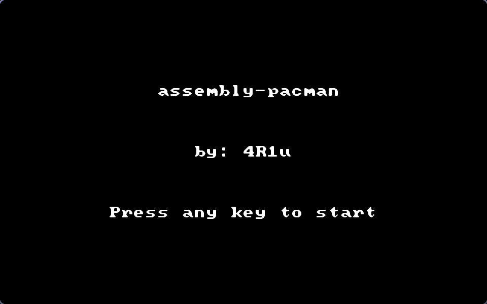

# assembly-pacman

## Overview

A simplistic implementation of Pac-Man in 16-bit x86 Assembly for the DOSBox 
environment.
This was the final project in the "Computer Organization and Assembly Language"
course at my university.

- This game runs in mode 13h, like a number of games from the DOS era.
- It runs in real mode
- The game loads a map file into "VRAM," and constantly tracks the locations of 
and redraws sprites.
- The project is compiled with NASM

## Installation

1. [Install DOSBox](https://www.dosbox.com/download.php?main=1)
2. Download and extract or clone this repo to a folder

```bash
git clone git@github.com:4R1u/assembly-pacman.git ~/Downloads/assembly-pacman
```

3. [Install NASM](https://www.nasm.us/pub/nasm/snapshots/latest/dos/) into a
new folder in the parent directory of the game, such as `~/Downloads/nasm` in
this case
4. Launch DOSBox
5. Mount the folder in which NASM resides

```dos
MOUNT C ~/Downloads/
```

6. Switch to the mounted drive

```dos
C:
```

7. Switch to the folder which has the NASM executable

```dos
cd NASM
```

8. Compile the game (use TAB completion, because DOSBox has length limits):

```dos
NASM.EXE C:/assem<TAB>/main.asm -o C:/assem<TAB>/game.com
```

9. Switch to the directory which has the game:

```dos
cd C:/assem<TAB>
```

10. Run the game:

```dos
game.com
```

You can change the directories, the main thing to keep in mind is that NASM 
has to be accessible from your mount point, and that the game executable and 
`map.bmp` have to be in the _current_ directory when you run the game.

### (Optional) How to make the game look smooth like in the screenshots

1. Open your [dosbox.conf](https://www.dosbox.com/wiki/Dosbox.conf#scaler_.3D_none_.7C_normal2x_.7C_normal3x_.7C_tv2x_.7C_tv3x_.7C_rgb2x_.7C_rgb3x_.7C_scan2x_.7C_scan3x_.7C_advmame2x_.7C_advmame3x_.7C_advinterp2x_.7C_advinterp3x_.7C_2xsai_.7C_super2xsai_.7C_supereagle_.7C_hq2x_.7C_hq3x) options. 
2. Ctrl-F replace `scaler=normal2x` with `scaler=hq3x`

## How to play

You will be shown an intro screen (this was one of the requirements of the 
project). Press any key to start the game.



The game then starts, and the ghosts and pacman start moving.


- Pac-Man loses a life when he runs into a ghost
- The score increments whenever Pac-Man eats a dot

The game ends when Pac-Man loses his three lives, or when the score reaches 
248.

The game then returns to text-mode and shows you the score.


## Limitations

Since this project was to be made in Assembly, and I didn't use a logical 
"grid", my project has some places it lacks in:

### The ghosts' pathfinding

Since this is Assembly, implementing a path-finding algorithm would have been 
pretty difficult within the short time span I had for the project.

Also, the grading scheme for the project wanted random movement for the ghosts, 
so that is what I implemented with a 32-bit Xorshift algorithm.

To make the ghosts more difficult to counter, I made the ghosts move every
tick, and Pac-Man only every 30 ticks. This compensates for the fact that the 
ghosts tend to stay in the general area of one place, and makes them leave 
their starting area faster.

### Collision detection

I couldn't get my function that detects if Pac-Man had collided with a ghost 
to work, so I just made it run a manual check for each of the corners.
